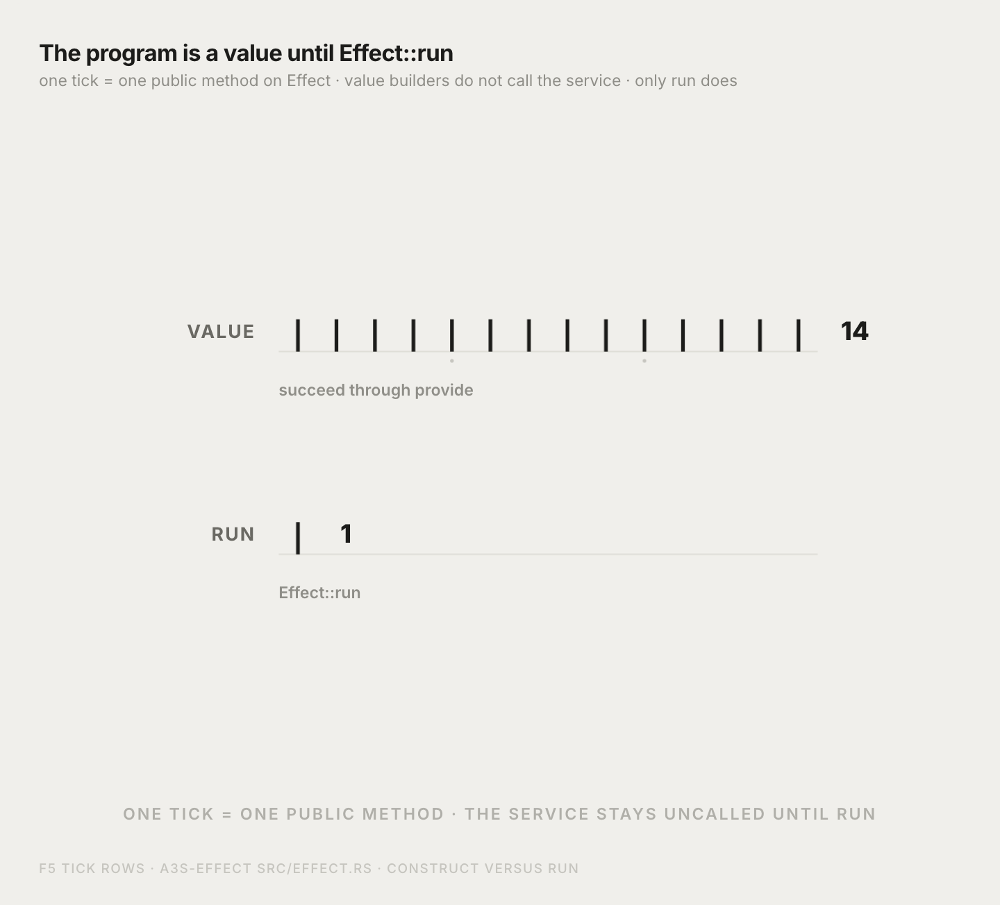
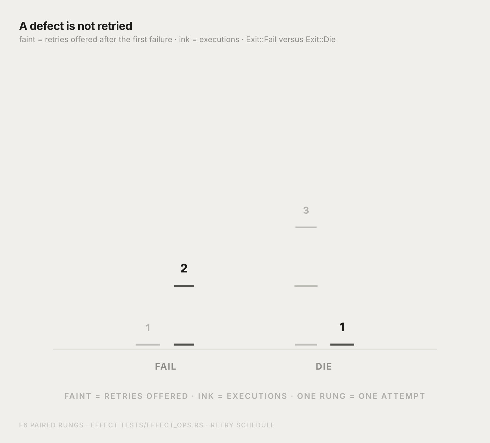
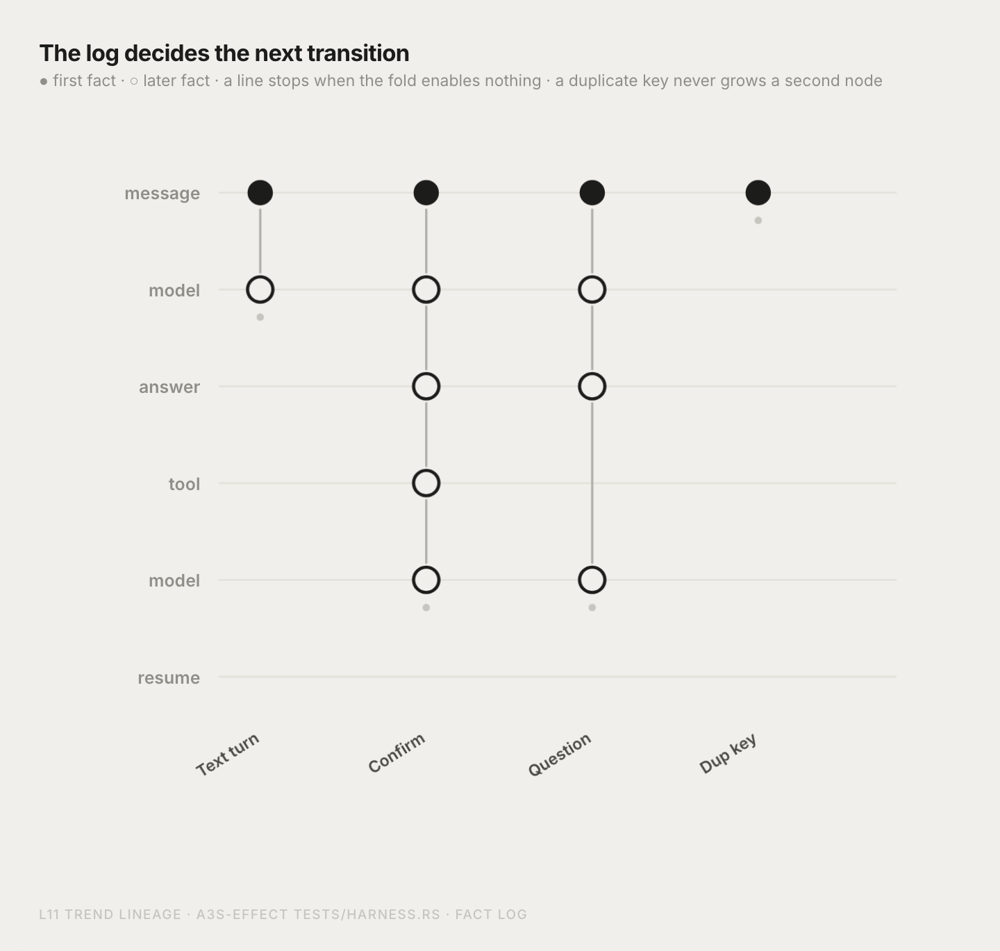
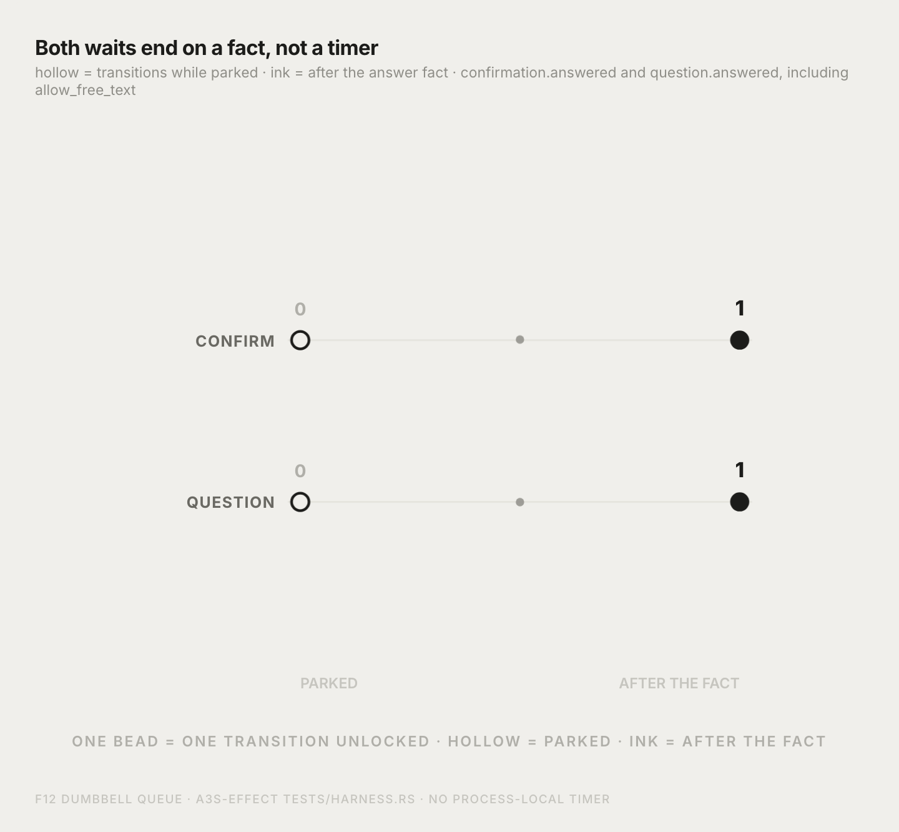

# a3s-effect

[English](README.md)

`a3s-effect` 是 A3S Code harness 的 actor 运行时，检出目录是 `packages/effect`。它把两件事分开，其余设计都从这里长出来。

一次转移是一个程序值。它写明成功值、预期错误，以及需要的服务。这份描述本身不会去调用模型、工具或压缩器。[`Effect::run`](src/effect.rs) 才是执行它的边界。

一条线程是一份不可变的事实日志。组件把日志折成视图，以及这个视图允许发生的转移。运行时执行这些转移，把它们返回的事实追加进去，再折一次。恢复时读的是同一份日志。确认和提问会停住，直到一条回答事实到来。这两种等待都不是进程内的计时器。

这个 crate 不是别的 agent 框架的移植，也不内嵌 TypeScript 的 Effect 运行时。下面四张图是代码里已经实现的四条结论。

## 程序在运行之前只是一个值

[`Effect`](src/effect.rs) 是一份描述。构造它、对它做 `map`，或者套上 `retry`，都不会进入服务。构造测试里，服务调用在 `Effect::run` 之前是 0，运行之后是 1。

有十四个公开方法返回另一个 `Effect`：`succeed`、`fail`、`die`、`from_async`、`map`、`and_then`、`catch_fail`、`retry`、`timeout`、`with_span`、`zip_par`、`race`、`bracket`、`provide`。真正执行描述的只有一个方法。



## 缺陷不会被重试

[`Exit`](src/exit.rs) 有三种停止。`Exit::Fail` 携带 [`ActorError`](src/error.rs)，是预期失败。`Exit::Die` 是缺陷。`Exit::Interrupt` 是父作用域发出的取消。

`retry` 只重复 `Exit::Fail`。算子测试里，一次失败如果还剩一次重试，会执行两次。一次缺陷即使还剩三次重试，也只执行一次。`catch_fail` 处理 `Exit::Fail`，并让 `Exit::Die` 继续传出去。



## 下一次转移只由日志决定

[`resume`](src/actor.rs) 折叠已经落盘的事实。每个组件的 `step` 消费一条事实，`output` 返回视图和这个状态允许的转移。某个转移键如果已经是某条事实的 `cause`，就不会再被选中。所以一段已经结束的文本回合再 `resume` 一次，不会追加事实，也不会再调用模型。

如果两个组件启用了同一个键，投影会返回 `ActorError::DuplicateTransition`，两个 effect 函数体都不会运行。

文本回合停在 `model.turn`。确认线程沿着回答和工具往下长。提问线程沿着 `question.answered` 往下长，下一次落在第二行模型调用上，不是工具结果。重复的键停在入口事实。



## 两种等待都结束于一条事实

编码调度器停在 `CodingPhase::Confirm`，直到出现 `confirmation.answered`；停在 `CodingPhase::Question`，直到出现 `question.answered`。提问视图保留模型决定里的 `allow_free_text`。停住时折叠不会启用任何转移，所以 `resume` 的步数是 0。这条路径上没有超时。

`confirmation.answered` 且 `approved: true` 之后，工具转移执行一次。`question.answered` 之后，下一次模型回合执行一次。拒绝会结束这一回合，并且不调用工具。



## 同一套规则还覆盖这些

它们仍是上面两种机制，不是额外的哲学。

| 机制 | 所在位置 |
| --- | --- |
| 重试、兄弟任务取消、以及在每一种退出时释放资源 | `Effect::retry`、`Effect::zip_par`、`Effect::bracket` |
| 服务写在类型里，在边界上替换 | 类型参数 `S` 和 `Effect::provide` |
| 运行时记录的 span | `Effect::with_span` |
| 不是事实的日志行 | `parse_fact_json` |
| 无法运行的 harness | `HarnessConfig::new` 拒绝步数上限为 0 或模型尝试次数为 0 |

`coding_actor` 是存量 Meta Harness 树的语法糖：在同一份日志上挂 `system`、
`tools`、`budget`、`compact` 与 `infer(scheduler)`。宿主也可通过
[`compose`](src/compose.rs)（`system`、`tools`、`budget`、`compact`、`infer`、
`HarnessGraph`）自行组装。嵌套的 `infer([...])` 会给子转移键加命名空间；
存量 Infer 部件不给调度器加前缀，以保持既有 fact-log cause 稳定。

```rust
let config = HarnessConfig::new(4, 8_000, 32, 2, vec!["You are a coding harness.".into()], vec![])?;
let actor = coding_actor(config);
```

在这个目录运行测试：

```bash
cargo test
```
